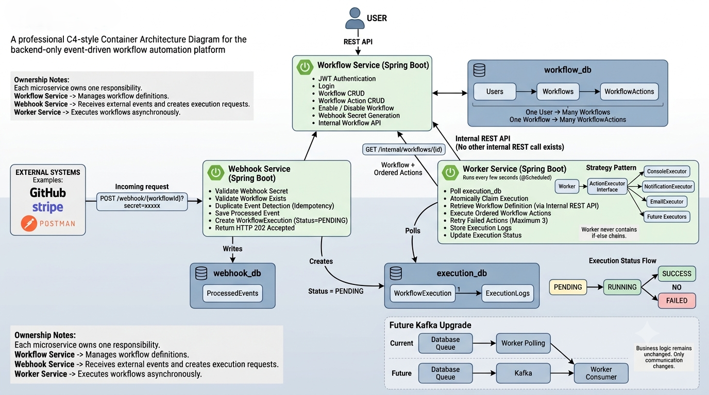

<div align="center">

# ⚡ KinetiX

### Event-Driven Workflow Automation Platform


### 🚀 A Microservices-Based Workflow Automation Engine

*KinetiX is a backend workflow automation platform inspired by Zapier and n8n. It enables users to create workflows that are triggered through webhooks and executed asynchronously using Apache Kafka and dedicated worker services.*

</div>

---

# 📖 Overview

KinetiX is an event-driven workflow automation platform built with a microservices architecture. Users can define workflows containing multiple actions, which are triggered through incoming webhooks.

Instead of executing workflows synchronously, KinetiX publishes workflow execution events to Apache Kafka. Dedicated Worker Services consume these events and execute workflow actions independently, making the system scalable, loosely coupled, and fault tolerant.

The project demonstrates modern backend engineering concepts such as asynchronous processing, event-driven communication, distributed services, and clean layered architecture.

---

# ✨ Features

## ⚙️ Workflow Management

- Create Workflow
- View Workflow
- Update Workflow
- Delete Workflow
- Enable Workflow
- Disable Workflow

---

## 🎯 Workflow Actions

Current Supported Actions

- 📝 Log Message
- 💾 Save Notification
- 🌐 HTTP Request

The execution engine is extensible, allowing new action types to be added with minimal changes.

---

## 🔗 Webhook Trigger

Each workflow exposes a public webhook endpoint.

```http
POST /webhook/{workflowId}
```

Incoming payloads trigger asynchronous workflow execution.

---

## ⚡ Event-Driven Processing

```
Webhook Request
        │
        ▼
Webhook Service
        │
Publishes Event
        │
        ▼
 Apache Kafka
        │
        ▼
 Worker Service
        │
 Executes Workflow
        │
        ▼
 Stores Logs & Updates Status
```

---

## 📊 Execution Tracking

Each execution stores

- Current Status
- Start Time
- End Time
- Execution Duration
- Retry Count
- Failure Reason

---

## 📜 Execution Logging

Every workflow action generates execution logs containing

- Timestamp
- Action Executed
- Execution Result
- Error Details
- Response Information

---

## 🔁 Retry Mechanism

Failed workflow executions are retried automatically until the configured retry limit is reached.

---

## 🚫 Idempotent Processing

Duplicate webhook events are detected and ignored to prevent duplicate workflow executions.

---

# 🏗️ System Architecture

<p align="center">

</p>

---

# 🏛️ Microservices

## 🔹 Workflow Service

Responsible for

- Workflow Management
- Workflow Actions
- Workflow Validation
- Internal APIs

Database

```
workflow_db
```

---

## 🔹 Webhook Service

Responsible for

- Receiving Webhooks
- Payload Validation
- Duplicate Event Detection
- Publishing Kafka Events

Database

```
webhook_db
```

---

## 🔹 Worker Service

Responsible for

- Kafka Consumer
- Workflow Execution
- Retry Handling
- Execution Logging
- Status Updates

Database

```
worker_db
```

---

# 🧩 Technology Stack

## 💻 Backend

| Technology | Purpose |
|------------|---------|
| ☕ Java 21 | Programming Language |
| 🌱 Spring Boot 4.1 | Backend Framework |
| 📦 Spring Data JPA | Data Persistence |
| 🗄️ Hibernate | ORM Framework |
| 🌐 REST APIs | Service Communication |
| 📦 Maven | Dependency Management |

---

## 📨 Messaging

| Technology | Purpose |
|------------|---------|
| 📨 Apache Kafka | Event Streaming |
| ⚡ Kafka Producer | Publish Workflow Events |
| ⚡ Kafka Consumer | Execute Workflow Events |

---

## 🗄️ Database

| Technology | Purpose |
|------------|---------|
| 🐬 MySQL | Persistent Storage |
| 🗃️ Separate Database Per Service | Microservice Isolation |

---

## 🛠️ Development Tools

- IntelliJ IDEA
- Maven
- Git
- GitHub
- Postman

---

# 📂 Project Structure

```
KinetiX
│
├── Workflow-Service
│
├── Webhook-Service
│
├── Worker-Service
│
├── architecture.png
│
└── README.md
```

---

# 🔄 Workflow Execution Flow

```
Client

↓

Webhook Request

↓

Webhook Service

↓

Validate Request

↓

Store Execution

↓

Publish Event

↓

Apache Kafka

↓

Worker Service

↓

Consume Event

↓

Fetch Workflow

↓

Execute Actions

↓

Generate Logs

↓

Update Execution Status

↓

SUCCESS / FAILED
```

---

# 🗄️ Database Architecture

```
MySQL

├── workflow_db
│
│   ├── workflows
│   └── workflow_actions
│
├── webhook_db
│
│   └── processed_events
│
└── worker_db
    
    └── execution_logs
```

---

# 📨 Kafka Communication

```
Webhook Service

        │

Kafka Producer

        │

workflow-execution-topic

        │

Kafka Consumer

        │

Worker Service

        │

Workflow Execution
```

---

# 📋 REST APIs

## Workflow Service

```http
POST   /workflows
GET    /workflows
GET    /workflows/{id}
PUT    /workflows/{id}
DELETE /workflows/{id}
PATCH  /workflows/{id}/enable
PATCH  /workflows/{id}/disable
```

---

## Webhook Service

```http
POST /webhook/{workflowId}
```

## Worker Service

No public APIs.

Continuously listens to Kafka topics and executes workflow events.

---

# 📈 Scalability Highlights

- ✅ Microservices Architecture
- ✅ Event-Driven Communication
- ✅ Apache Kafka Messaging
- ✅ Asynchronous Workflow Execution
- ✅ Independent Databases
- ✅ Retry Mechanism
- ✅ Idempotent Event Processing
- ✅ Layered Architecture
- ✅ Modular Service Design

---

# 🧠 Backend Concepts Demonstrated

- Java 21
- Spring Boot
- Spring Data JPA
- Hibernate
- REST APIs
- Apache Kafka
- Event-Driven Architecture
- Producer–Consumer Pattern
- Asynchronous Processing
- Microservices
- Layered Architecture
- Repository Pattern
- DTO Pattern
- Global Exception Handling
- Retry Mechanism
- Execution Logging
- Database-per-Service Pattern

---


# 🚀 Future Enhancements

- Docker Containerization
- Kubernetes Deployment
- API Gateway
- Service Discovery
- Monitoring & Metrics
- Distributed Tracing
- Dead Letter Queue (DLQ)
- Email Notifications
- Workflow Dashboard
- Workflow Visual Builder

---

# 👨‍💻 Author

**Parth Deokate**

**Backend Developer | Java | Spring Boot | Apache Kafka | REST APIs | MySQL | Microservices**

---

<div align="center">

### ⭐ If you found this project useful, consider giving it a Star!

</div>